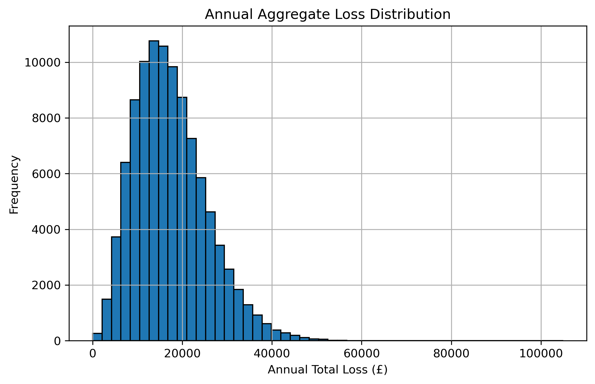
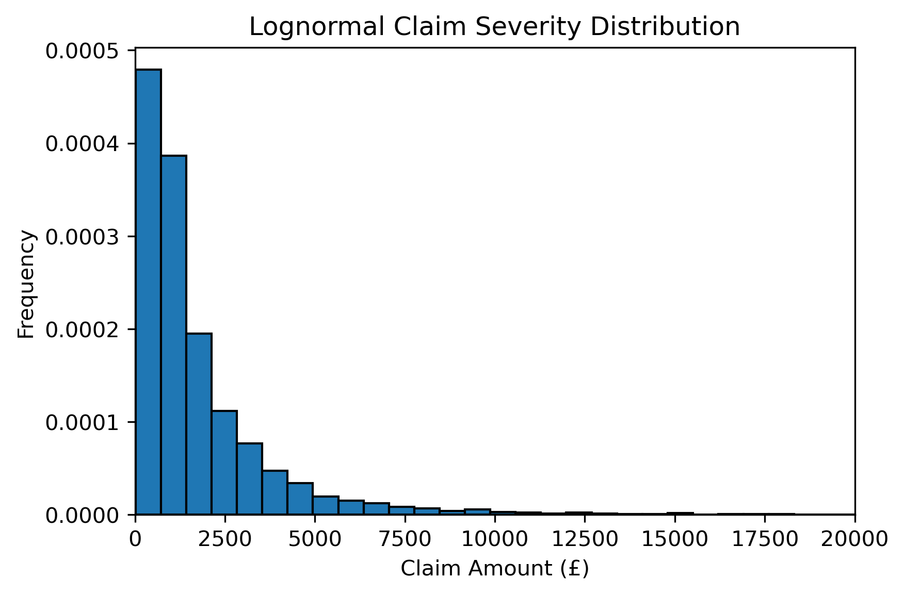
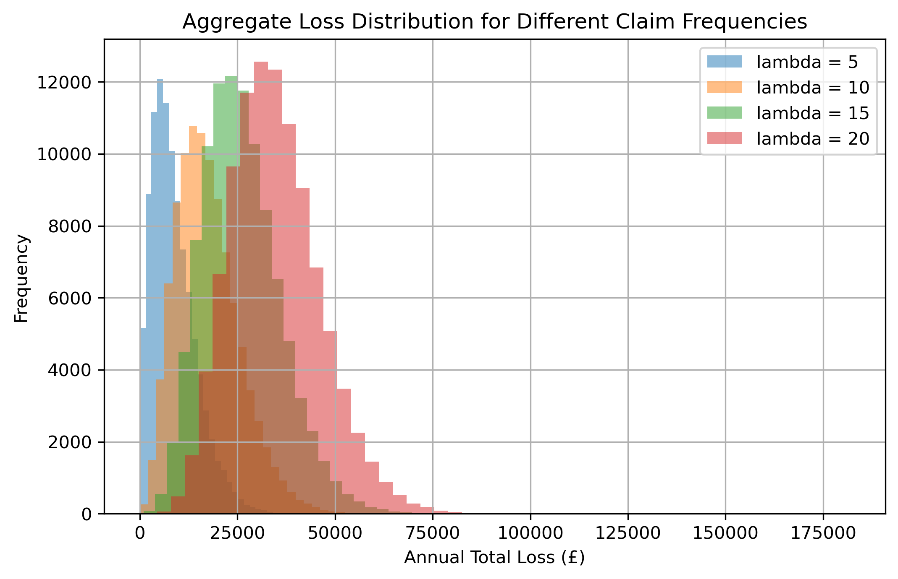
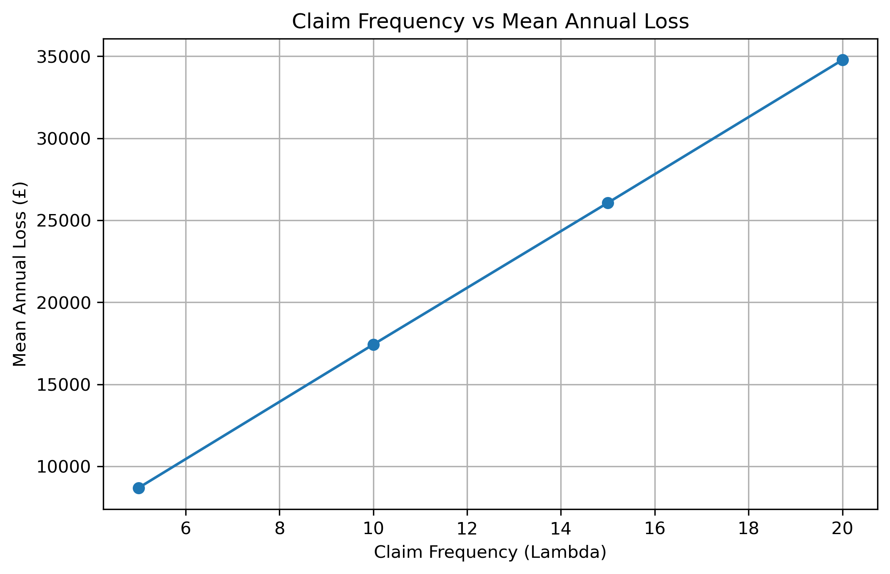
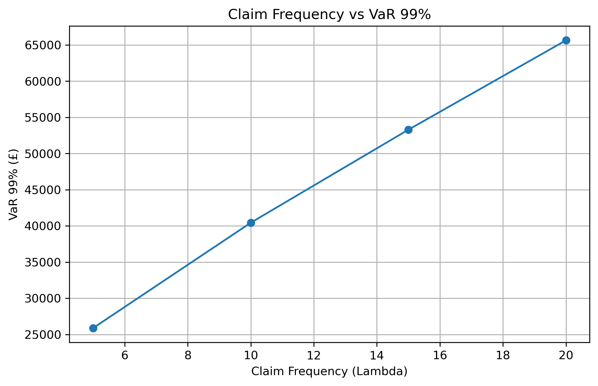

# Actuarial Risk Model

Monte Carlo simulation of aggregate insurance losses using a compound Poisson–Lognormal frequency-severity model. The project demonstrates how stochastic simulation can be used to estimate portfolio losses and calculate common actuarial risk measures.

---

## Overview

This project models annual aggregate insurance losses by combining:

- **Claim frequency** using a Poisson distribution.
- **Claim severity** using a Lognormal distribution.
- **Monte Carlo simulation** to generate annual loss distributions.

The model applies a simple **per-claim excess-of-loss reinsurance treaty** to simulate retained insurer losses and calculates common actuarial risk measures.

---

## Mathematical Model

Annual aggregate loss is modelled as

**S = X₁ + X₂ + ... + Xₙ**

where

- **N** follows a Poisson distribution with parameter **λ**.
- Each claim amount **X** follows a Lognormal distribution with parameters **μ** and **σ**.

A per-claim excess-of-loss reinsurance layer is applied with:

- Attachment point: **£10,000**
- Limit: **£50,000**

---

## Risk Measures

For each simulated portfolio the model calculates:

- Mean annual loss
- Standard deviation
- 95% Value at Risk (VaR)
- 99% Value at Risk (VaR)
- 99% Expected Shortfall (ES)

Sensitivity analysis is performed for different claim frequencies:

- λ = 5
- λ = 10
- λ = 15
- λ = 20

---

## Sample Outputs

### Aggregate Loss Distribution



Shows the simulated annual aggregate loss distribution for a representative insurance portfolio.

---

### Claim Severity Distribution



Illustrates the Lognormal distribution used to model individual claim severities.

---

### Aggregate Loss Distribution Sensitivity



Compares aggregate loss distributions for different Poisson claim frequencies, demonstrating how increasing λ shifts the portfolio loss distribution.

---

### Mean Annual Loss vs Claim Frequency



Shows the relationship between expected claim frequency and mean annual aggregate loss.

---

### VaR 99% vs Claim Frequency



Illustrates how extreme portfolio risk increases as expected claim frequency increases.

---

## Results

The model exports a summary table containing:

- Mean annual loss
- 95% Value at Risk
- 99% Value at Risk
- 99% Expected Shortfall

The results are saved to:

```text
results/tables/aggregate_claim_results.csv
```

---

## Project Structure

```text
actuarial-risk-model/

├── aggregate_loss_model.py
├── README.md
├── requirements.txt
├── .gitignore
├── LICENSE
└── results/
    ├── plots/
    │   ├── claim_severity.png
    │   ├── frequency_sensitivity_distribution.png
    │   ├── loss_distribution.png
    │   ├── mean_loss_sensitivity.png
    │   └── var99_sensitivity.png
    │
    └── tables/
        └── aggregate_claim_results.csv
```

---

## Installation

Clone the repository:

```bash
git clone https://github.com/rubenhumphries/aggregate-loss-model.git
```

Install the required packages:

```bash
pip install -r requirements.txt
```

Run the model:

```bash
python aggregate_loss_model.py
```

---

## Technologies Used

- Python
- NumPy
- Pandas
- Matplotlib

---

## Future Improvements

Potential extensions include:

- Alternative severity distributions (Gamma, Pareto, Weibull)
- Frequency calibration from real claims data
- Gross versus net reinsurance comparison
- Catastrophe loss modelling
- Capital modelling under Solvency II
- Parameter estimation using maximum likelihood science, stochastic modelling and quantitative risk analysis.
